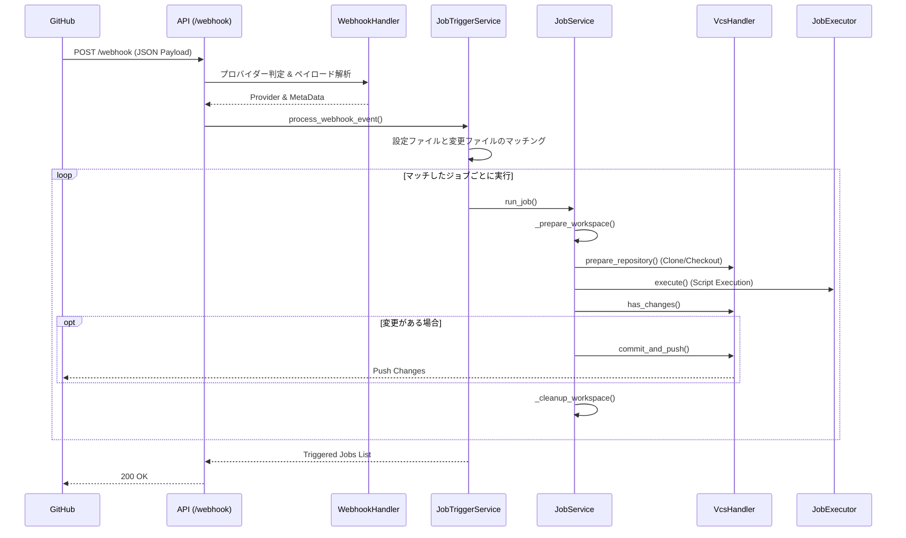

# システム概要 (System Overview)

ToyCI Serverは、軽量なCI (Continuous Integration) サーバーです。GitHub等のVCSプロバイダーからのWebhookを受け取り、定義されたジョブ（スクリプト）を実行し、結果に応じてリポジトリへの変更をコミット・プッシュします。

## アーキテクチャ

システムは以下のレイヤーで構成されています。

1.  **API Layer (`src/api.py`)**: 外部からのHTTPリクエスト (Webhook) を受け付けます。
2.  **Logic Layer (`src/core/job_trigger.py`, `src/core/webhook_handler.py`)**: Webhookペイロードを解析し、実行すべきジョブを決定します。
3.  **Execution Layer (`src/core/job_service.py`)**: ジョブの実行フロー（ワークスペース準備、チェックアウト、スクリプト実行、後処理）を制御します。
4.  **Infrastructure Layer (`src/core/vcs_handler.py`, `src/core/job_executor.py`, `src/core/workspace_manager.py`)**: 実際のGit操作、シェルスクリプト実行、ファイルシステム操作を行います。

## データフロー

## ディレクトリ構造

*   `src/`: ソースコード
    *   `api.py`: FastAPIアプリケーションエントリーポイント
    *   `main.py`: サーバー起動スクリプト
    *   `core/`: コアロジックモジュール
*   `config.yaml`: ジョブ設定ファイル
*   `logging.yaml`: ログ設定ファイル
