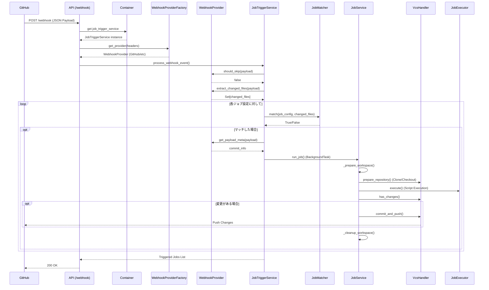

# システム概要 (System Overview)

ToyCI Serverは、軽量なCI (Continuous Integration) サーバーです。GitHub等のVCSプロバイダーからのWebhookを受け取り、定義されたジョブ（スクリプト）を実行し、結果に応じてリポジトリへの変更をコミット・プッシュします。

## アーキテクチャ

システムは以下のレイヤーで構成されています。

1.  **API Layer ([`src/api.py`](../src/api.py:1))**: 外部からのHTTPリクエスト (Webhook) を受け付けます。FastAPIのlifespanイベントでDIコンテナを初期化します。
2.  **Container Layer ([`src/core/container.py`](../src/core/container.py:1))**: Dependency Injection コンテナとして、各サービスのインスタンスを管理します。シングルトンパターンで実装されています。
3.  **Logic Layer ([`src/core/job_trigger.py`](../src/core/job_trigger.py:1), [`src/core/webhook_handler.py`](../src/core/webhook_handler.py:1), [`src/core/job_matcher.py`](../src/core/job_matcher.py:1))**: Webhookペイロードを解析し、実行すべきジョブを決定します。
4.  **Execution Layer ([`src/core/job_service.py`](../src/core/job_service.py:1))**: ジョブの実行フロー（ワークスペース準備、チェックアウト、スクリプト実行、後処理）を制御します。
5.  **Infrastructure Layer ([`src/core/vcs_handler.py`](../src/core/vcs_handler.py:1), [`src/core/job_executor.py`](../src/core/job_executor.py:1), [`src/core/workspace_manager.py`](../src/core/workspace_manager.py:1))**: 実際のGit操作、シェルスクリプト実行、ファイルシステム操作を行います。

## データフロー

## ディレクトリ構造

*   `src/`: ソースコード
    *   [`api.py`](../src/api.py:1): FastAPIアプリケーションエントリーポイント
    *   [`main.py`](../src/main.py:1): サーバー起動スクリプト（CLI引数サポート）
    *   `core/`: コアロジックモジュール
        *   [`config.py`](../src/core/config.py:1): Pydanticベースの設定管理
        *   [`container.py`](../src/core/container.py:1): DIコンテナ
        *   [`interfaces.py`](../src/core/interfaces.py:1): 抽象インターフェース定義
        *   [`job_service.py`](../src/core/job_service.py:1): ジョブ実行サービス
        *   [`job_trigger.py`](../src/core/job_trigger.py:1): ジョブトリガーサービス
        *   [`job_matcher.py`](../src/core/job_matcher.py:1): ジョブマッチングロジック
        *   [`webhook_handler.py`](../src/core/webhook_handler.py:1): Webhookプロバイダー実装
        *   [`webhook_factory.py`](../src/core/webhook_factory.py:1): プロバイダーファクトリ
        *   [`vcs_handler.py`](../src/core/vcs_handler.py:1): VCS操作ハンドラー
        *   [`vcs_utils.py`](../src/core/vcs_utils.py:1): VCS関連ユーティリティ
        *   [`job_executor.py`](../src/core/job_executor.py:1): ジョブ実行エグゼキューター
        *   [`workspace_manager.py`](../src/core/workspace_manager.py:1): ワークスペース管理
        *   [`logging_config.py`](../src/core/logging_config.py:1): ロギング設定
*   [`config.yaml`](../config.yaml:1): ジョブ設定ファイル
*   [`logging.yaml`](../logging.yaml:1): ログ設定ファイル
*   `.env`: 環境変数設定ファイル（オプション、Gitで管理されない）
*   `docs/`: ドキュメント
*   `tests/`: テストコード
*   `workspace/`: ジョブ実行用ワークスペース（自動生成）

## 設計パターン

### Dependency Injection (DI)
[`Container`](../src/core/container.py:1) クラスがシングルトンパターンで実装され、各サービスのインスタンスを一元管理します。これにより、テスタビリティと保守性が向上しています。

### Factory Pattern
[`WebhookProviderFactory`](../src/core/webhook_factory.py:1) がリクエストヘッダーに基づいて適切なWebhookプロバイダーを返します。新しいVCSプロバイダーの追加が容易です。

### Strategy Pattern
[`IJobMatcher`](../src/core/interfaces.py:31) インターフェースにより、ジョブマッチングロジックを柔軟に変更できます。現在は glob パターンマッチングを実装しています。

### Interface Segregation
[`interfaces.py`](../src/core/interfaces.py:1) で定義された抽象インターフェースにより、実装の詳細から分離され、モックやスタブの作成が容易になっています。
